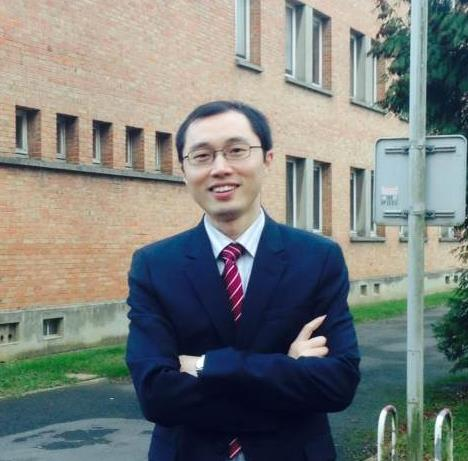

## **About me**

**Professor of linguistics, School of Liberal Arts, Nanjing University**

Hi, I am Qiongpeng Luo (first/given name: Qiongpeng; last/family name: Luo; in Chinese characters: 罗琼鹏 (simplified) or 羅瓊鵬 (traditional)). I am a linguist specializing in formal semantics and semantics-syntax interface with special reference to Mandarin Chinese and other languages in China and East Asia within a cross-linguistic perspective. I studied linguistics at Utrecht University from 2007-2008 (under the supervision of Prof. Martin Everaert and the late Tanya Reinhart) and Peking University, from which I obtained my PhD degree in 2009. After obtaining my doctoral degree, I worked as a post-doc research fellow at Macquarie Center for Cognitive Science of Macquarie University in Sydney from 2009 to 2011 (under Prof. Stephen Crain). Currently I am professor of linguistics at the School of Liberal Arts, Nanjing University, China.

---
## **Research interests**

- **Broad**: Formal semantics; Semantics-syntax interface; Semantics-pragmatics interface;
- **Narrow**: (1) Degree and measurement; (2) Semantic incorporation; (3) Expressive meaning; (4) The semantics of kind; (5) Event structure and verbal semantics.

---
## **Selected research output** in English
1. A kind-based account of adjectival modification in Mandarin Chinese. **Linguistics and Philosophy**. (R&R)
2. Degree kinds, difference, and the semantics of Differential Verbal Comparatives in Mandarin Chinese. **Journal of Semantics**. (with minor revision)
3. 2023, Degrees and grammar: An East Asian perspective. **Language and Linguistics** 24(1):5-35. (Co-authored with Zhiguo Xie and Xiao Li; 1/3) (SSCI and A&HCI) [Download](https://www.jbe-platform.com/content/journals/10.1075/lali.00124.luo)
4. 2022, Bare nouns, incorporation, and event kinds in Mandarin Chinese. **Journal of East Asian Linguistics** 31(2): 221-263. (SSCI and A&HCI) [Link](https://link.springer.com/article/10.1007/s10831-022-09239-1) or [Download](https://www.researchgate.net/publication/365687560_Bare_nouns_incorporation_and_event_kinds_in_Mandarin_Chinese)
5. 2022, The semantics of scalar equatives in Mandarin Chinese. **Language and Linguistics** 24(1): 121-148.(Co-authored with Y. Cao; Corresponding author) (SSCI and A&HCI) [Download](https://www.jbe-platform.com/content/journals/10.1075/lali.00127.cao)
6. 2021, Characterizing the simplex vs. complex adjectives in Mandarin Chinese. In P. G. Grosz, L. Marti, H. Pearson, Y. Sudo & S. Zobel (eds.), **Proceedings of Sinn und Bedeutung 25 (SuB 25)**, 600-617. University College London and Queen Mary University of London. [Download](https://ojs.ub.uni-konstanz.de/sub/index.php/sub/article/view/956)
7. 2020, The architecture of the perfective viewpoint aspect in Mandarin. **Proceedings of Chicago Linguistic Society 56** (CLS 56). The University of Chicago. (Co-aurhoed with Anqi Zhang; 1/2)
8. 2019, Degree intensifiers as expressives in Mandarin Chinese. **Language and Linguistics** 20(2):256-281. (Co-aurhoed with Zhiguo Xie; Corresponding author)(SSCI and A&HCI) [Download](https://benjamins.com/catalog/lali.00033.xie)
9. 2019, Equatives are not all equal: A correlative analysis of scalar equatives in Mandarin. In Eszter Ronai, Laura Stigliano and Yenan Sun (eds.), **Proceedings of Chicago Linguistic Society 54** (CLS 54), 283-294. The University of Chicago. (Co-authored with Y. Cao)
10. 2019, Degrees as nominalized properties: evidence from differential verbal comparatives in Chinese. In Uli Sauerland & Stephanie Solt (eds.), **Proceedings of Sinn und Bedeutung** 22(2): 89-106. Berlin: Leibniz-Zentrum Allgemeine Sprachwissenshaft (ZAS) (Leibniz Center for General Linguistics). (Co-aurhoted with Zhiguo Xie) [Download](https://ojs.ub.uni-konstanz.de/sub/index.php/sub/article/view/72)
11. 2017, Pre-classifier adjectival modification in Mandarin Chinese: a measurement-based analysis. **Journal of East Asian Linguistics** 26(1): 1-36. (Co-aurhoed with M. Hsieh and D. Shi; 1/3) (SSCI and A&HCI) [Download](https://link.springer.com/article/10.1007/s10831-016-9149-2)
12. 2017, When degree meets evaluativity: a multidimensional semantics for the ad-adjectival modifier hao ‘well’ in Mandarin Chinese. **Lecture Notes in Artificial Intelligence (LNAI)** 10085, 475-492. Springer. [Download](https://link.springer.com/chapter/10.1007/978-3-319-49508-8_45)
13. 2011, Identity and definiteness in Chinese wh-conditionals. In Reich Ingo et at. (eds.), **Proceedings of Sinn und Bedeutung 15** (SuB 15), 165-179. Saarbrucken, Germany: Saarland University Press. (Co-aurhored with Stephen Crain) [Download](https://ojs.ub.uni-konstanz.de/sub/index.php/sub/article/view/370)
14. 2011, _Mei_ and _dou_ in Chinese: a tale of two quantifiers. **Taiwan Journal of Linguistics** 9(2):111-158. [Download](http://tjl.nccu.edu.tw/main/uploads/9.2-3__.pdf)
15. 2011, Do Chinese wh-conditionals have relatives in other languages?. **Language and Linguistics** 12(4):753-798. (Co-authored with Stephen Crain) (SSCI and A&HCI)[Download](https://www.ling.sinica.edu.tw/item/zh-tw?act=journal&code=directory&volume=12&period=4)
16. 2011, Uniqueness and co-variation in Chinese wh-conditionals. In Yukio Otsu (ed.), **The Proceedings of the 12th Tokyo Conference on Psycholinguistics** (TCP 12). Tokyo: Hituzi Publishing Company. (Co-authored with Stephen Crain) [Download](https://www.researchgate.net/publication/310952699_Uniqueness_and_Co-variation_in_Chinese_Wh-conditionals)
17. 2010, On the typology of wh-conditionals in Chinese. In Yukio Otsu (ed.), **The Proceedings of the 11th Tokyo Conference on Psycholinguistics** (TCP 11), 97-120. Tokyo: Hituzi Publishing Company. (Co-authored with Stephen Crain)
18. 2008, Functional quantification in distributivity and events: A view from Chinese. In Maribel Romero (ed.), **Proceedings of ESSLLI 2008 Workshop ‘What Syntax Feeds Semantics’**, 48-59. Germany: Konstanz University.

## **Domestic publications in Chinese**
(CSSCI = China Social Sciences Citation Index)
1. 2024, Yuyi ronghe yu hanyu feidianxing binyu jiegou 语义融合与汉语非典型宾语结构 [Semantic incorporation and non-canonical object constructions in Chinese]. **Zhongguo Yuwen 中国语文** [Studies of Chinese Language] (3):301-316. (CSSCI)
2. 2024, Mingci ronghe yu fuza weici de xingcheng 名词融合与复杂谓词的形成 [Noun incorporation and the formation of complex predicates in Chinese]. **Hanyu Xuexi 汉语学习** [Chinese Language Learning] (1): 33-42. (CSSCI)
3. 2024, Kua yuyan shiyu xia mingci ronghe yanjiu de xianzhuang yu qianzhan 跨语言视阈下名词融合研究的现状与前瞻 [Noun incorporation in a cross-linguistic perspective]. **Waiyu Jiaoxue yu Yanjiu 外语教学与研究** [Foreign Language Teaching and Research] (2): 213-225. (CSSCI)
4. 2023, Zhuangtai bianhua yu liangji bianhua 状态变化与量级变化 [Change of states and scalar change]. **Dangdai Yuyanxue 当代语言学** [Contemporary Linguistics] (6):848-865. (CSSCI)
5. 2023, Duoweidu yuyixue shiyuxia fumian lichang biaoda de yiyi jizhi 多维度语义学视阈下负面立场表达的意义机制 [A multidimensional semantic study of negative evaluative meanings: The case of you+ge+NP]. **Waiyu Yanjiu 外语研究** [Foreign Languages Research] (1): 23-29. (Co-authored with Y. Cao). (CSSCI)
6. 2022, Liangji xiushiyu de yuyong weidu 量级修饰语的语用维度 [Pragmatic aspects of scalar modifiers]. **Shijie Hanyu Jiaoxue 世界汉语教学** [Chinese Teaching in the World] (4). (CSSCI) [CNKI Link](https://kns.cnki.net/kcms/detail/detail.aspx?dbcode=CJFD&dbname=CJFDLAST2022&filename=SJHY202204011&uniplatform=NZKPT&v=P8E7jlKlrBG56xn6Sc3fVBeU0aNyvt_i7CRtdJTHxlxqm4DIZvSQdBz9OlGvWZXh)
7. 2022, Pubian gongneng jizhu yu hanyu juzi de zizuxing 普遍功能脊柱与汉语句子的自足性 [The Universal Functional Spine and Sentential Completeness Effects in Chinese]. **Waiyu Jiaoxue yu Yanjiu 外语教学与研究** [Foreign Language Teaching and Research] 5. (CSSCI) [CNKI Link](https://kns.cnki.net/kcms/detail/detail.aspx?dbcode=CJFD&dbname=CJFDAUTO&filename=WJYY202205005&uniplatform=NZKPT&v=4kZmXCH6IOujm6LbWL0cQm0RKf5y1TvBimD5ULGvHgH08R7lH-v79l2uKMcUbImg)
8. 2022, Zhuangming xiushi jiegou de luoji wenti 专名修饰结构的逻辑问题 [On the logical problem of modified proper names]. **Hunan Keji Daxue Xuebao 湖南科技大学学报（社会科学版）** [Journal of Hunan University of Science and Technology] 2: 35-41. (CSSCI) [CNKI Link](https://kns.cnki.net/kcms/detail/detail.aspx?dbcode=CJFD&dbname=CJFDLAST2022&filename=XTGS202203005&uniplatform=NZKPT&v=BMnHiTGkrkITaEOb1wyfZsaAr3fL7lznNCj9hmNw9sUPrUXqjRDFsnUSDRhFu9zd)
9. 2021, Yinghanyu dengjixing xianxiang de yuyi yanjiu 英汉语等级性现象的语义研究[The semantics of gradability in English and Chinese]. **Jiefangjun Waiguoyu Xueyuan Xuebao 解放军外国语学院学报** [Journal of PLA University of Foreign Languages] 6. (CSSCI) [CNKI Link](https://kns.cnki.net/kcms/detail/detail.aspx?dbcode=CJFD&dbname=CJFDLAST2021&filename=JFJW202106009&uniplatform=NZKPT&v=awAtiZvvr8NA1jHwdBqBBBcyfK_nKR_VEjX1bXt1oYKtahVFc-cZq1_1T4vkKfgz)
10. 2021, Dengjixing, liangji jiegou yu “hen+NP” jiegou de yuyi yanjiu 等级性、量级结构与“很+名词”结构的语义分析 [Gradability, scale structure and the semantics of “hen+NP” structure]. **Hanyu Xuexi 汉语学习** [Chinese Language Learning] 5: 53-63. (CSSCI) [CNKI Link](https://kns.cnki.net/kcms/detail/detail.aspx?dbcode=CJFD&dbname=CJFDLAST2021&filename=HYXX202105006&uniplatform=NZKPT&v=3rEYGRdUnsYWC2p0_OOVQth4rFQAZO9mxr-q3l79Aoeea7VwmlcyJTtwNRYNO7jG)
11. 2020, Cong Liangji dao liangduan: gen “hai” youguan de jizhong yongfa deyuyi fenxi 从量级到量段——跟“还”有关的几种用法的语义分析 [A scale segment-based semantics for 
Mandarin adverb hai]. **Yuyan Kexue 语言科学** [Language Sciences] (6): 592-609. (CSSCI) [CNKI Link](https://kns.cnki.net/kcms/detail/detail.aspx?dbcode=CJFD&dbname=CJFDLAST2020&filename=YYKE202006003&uniplatform=NZKPT&v=0lH_ZqPxJbOe11LFwi9TmsRSFtsQyWwVKWiSliqopcSWTSe86CoXPNmN1sNTFf1v)
12. 2019, Yuyixue yu xingtai jufa bianyi: yi yinghanyu liangji dengbiju weili 语义学与形态句法变异：以英汉语量级等比句为例 [Semantics and morpho-syntactic variation: The case of scalar equatives in Mandarin and English]. **Waiguoyu 外国语** [Journal of Foreign Languages] 3: 47-59. (CSSCI) [CNKI Link](https://kns.cnki.net/kcms/detail/detail.aspx?dbcode=CJFD&dbname=CJFDLAST2019&filename=WYXY201903005&uniplatform=NZKPT&v=Ve3nWGzpR-WGEdBWWW2EZT2NMZjcjTY7eYakkydSfwhZyKx1jZZK0Q1IvwLD5toG)
13. 2019, Kua yuyan shijiao xia celiang jizhun de fenlie yu celiang jiegou de shengcheng 跨语言视角下测量基准的分裂与测量结构的生成 [The split of measurement standards and the derivation of measurement constructions: A cross-linguistic perspective]. **Waiyu Jiaoxue yu Yanjiu 外语教学与研究** [Foreign Language Teaching and Research] (1). (CSSCI) [CNKI Link](https://kns.cnki.net/kcms/detail/detail.aspx?dbcode=CJFD&dbname=CJFDLAST2019&filename=WJYY201901002&uniplatform=NZKPT&v=Iy1w-Tiw5okUR3EsYLmsKd36POts7QT3WvaH8DJvZq9iTwXd60oUNkx1YPZz7gaN)
14. 2019, Duo zai shuliang jiegou zhong de fenbu yu yuyi jieshi – jian tan celiang de jizhi “多”在数量结构中的分布与语义解释——兼谈测量的机制 [The distribution and interpretation of duo in quantity expressions and the grammar of measurement]. **Yuyan Kexue 语言科学** [Language Sciences] 1: 13-26. (CSSCI) [CNKI Link](https://kns.cnki.net/kcms/detail/detail.aspx?dbcode=CJFD&dbname=CJFDLAST2019&filename=YYKE201901003&uniplatform=NZKPT&v=pUDwlB8MHAp2zflH7KZcUlMrG1gbsJzX2CdNLaCkm5AV47ognE_FyOy2-Dz4sbD6)
15. 2018, Liangji jiegou yu hanyu xingrongci de jixing duili wenti 量级结构与汉语形容词的极性对立问题 [Scale structure and the polarity opposition of adjectives in Chinese] **Yuyan Yanjiu 语言研究** [Studies in Language and Linguistics] 2: 24-31. (CSSCI) [CNKI Link](https://kns.cnki.net/kcms/detail/detail.aspx?dbcode=CJFD&dbname=CJFDLAST2018&filename=YYYJ201802003&uniplatform=NZKPT&v=eF8tQZUJnWiqG5sJA8gIyw7Sn9Fq6Rycof4nHnqtvlVtzZHlwbicDPjEgsoMDxEM)
16. 2018, Dengjixing, liangji jiegou yu hanyu xingzhi xingrongci fenlei 等级性、量级结构与汉语性质形容词分类 [Gradability, scale structure, and the classification of simple adjectives in Chinese]. **Hanyu Xuexi 汉语学习** [Chinese Language Learning] 1: 27-38. (CSSCI) [CNKI Link](https://kns.cnki.net/kcms/detail/detail.aspx?dbcode=CJFD&dbname=CJFDLAST2018&filename=HYXX201801003&uniplatform=NZKPT&v=xZkYF7hFIpkDY5-u-wmmi-361ONdXKWlNqq-QFAH54M15u3WdUR7n3vCsfitiJfL)
17. 2017, Xiandai hanyu mingliang jiegou de liangzhong celiang yi 现代汉语名量结构的两种测量义 [Two types of measurements of the measure phrases in Chinese] **Yuyan Jiaoxue yu Yanjiu 语言教学与研究** [Language Teaching and Linguistic Studies] 6: 82-91. (CSSCI) [CNKI Link](https://kns.cnki.net/kcms/detail/detail.aspx?dbcode=CJFD&dbname=CJFDLAST2017&filename=YYJX201706012&uniplatform=NZKPT&v=sFHP62lCX1AMBoI_Sm-Kj5-OgWNB9BbonQtnhrz1HoBgAaN64tIhwve0bE8EKOI4)
18. 2017, Yiyi de duoweixing yu duoweidu yuyixue 意义的多维性与多维度语义学 [The multidimensionality of meaning and multidimensional semantics]. **Waiguoyu 外国语** [Journal of Foreign Languages] 5: 11-20.(CSSCI) [CNKI Link](https://kns.cnki.net/kcms/detail/detail.aspx?dbcode=CJFD&dbname=CJFDLAST2017&filename=WYXY201705003&uniplatform=NZKPT&v=Afgy3ZZOGX_dZXspuVU8ZqbX_fPw8fnqhNcpH030R4WH_kUkeMBIkvhep-Qwe89f)
19. 2017, Hanyu bi zi bijiaoju de jufa he yuyi wenti 汉语“比”字比较句的句法和语义问题 [The syntax and semantics of Mandarin bi comparatives]. **Xiandai Waiyu 现代外语** [Modern Foreign Languages] 3: 324-335. (CSSCI) [CNKI Link](https://kns.cnki.net/kcms/detail/detail.aspx?dbcode=CJFD&dbname=CJFDLAST2017&filename=XDWY201703004&uniplatform=NZKPT&v=oHjHKySghMWsKwJ2AMelTMPPj01mjADOiNlIQBW7fOyPtvi4xpYbGkCstIcAv8eg)
20. 2017, Hanyu mingci de chengdu yu dengjixing 汉语名词的程度与等级性 [Degree and gradability in the nominal domain of Chinese]. **Yuyanxue Yanjiu 语言学研究** [Linguistic Research], vol. 21, 97-109. (CSSCI) [CNKI Link](https://kns.cnki.net/kcms/detail/detail.aspx?dbcode=CCJD&dbname=CCJDLAST2&filename=YUYA201701010&uniplatform=NZKPT&v=WGQGV2bjxgyoXKJXZErkXNABowIMNRN1IpmhM9V3SC8EeigAkxYViT6YUoYPa2RZ)
21. 2017, Chengdu yuyixue shijiaoxia de yinghanyu bijiao jiegou yanjiu 程度语义学视角下的英汉语比较结构研究 [The syntax and semantics of comparison constructions in English and Chinese in a degree-based perspective]. **Tianjin Waiguoyu Daxue Xuebao 天津外国语大学学报** [Journal of Tianjin Foreign Studies University] 3: 30-38. [CNKI Link](https://kns.cnki.net/kcms/detail/detail.aspx?dbcode=CJFD&dbname=CJFDLAST2017&filename=TJWG201703006&uniplatform=NZKPT&v=IO_O0zaKMOfhDsL-pMHoglmt_WPgPp-d4Q_JqQP93yHnhf_dTLXfel5gpB569n92)
22. 2016, Chengdu, liangji yu xingrongci “zhen” he “jia” de yuyi 程度，量级与形容词“真”和“假”的语义 [Degree, scale and the semantics of zhen ‘true’ and jia ‘false’]. **Yuyan Yanjiu 语言研究** [Studies in Language and Linguistics] 2: 94-100. (CSSCI) [CNKI Link](https://kns.cnki.net/kcms/detail/detail.aspx?dbcode=CJFD&dbname=CJFDLAST2016&filename=YYYJ201602010&uniplatform=NZKPT&v=csmq_URGDdKlYKA38rvto3FH_79EMjcZFZCB8CqED9TnipWNEw1UzfBaq-jdD8rH)
23. 2016, You “da” wu “xiao”de “da+NP’ jiegou 有“大”无“小”的“大+NP”结构 [Gradable nouns and the degree interpretations of “Da ‘big’ +NP” constructions]. **Hanyu Xuexi 汉语学习** [Chinese Language Learning] 3: 43-52. (CSSCI) [CNKI Link](https://kns.cnki.net/kcms/detail/detail.aspx?dbcode=CJFD&dbname=CJFDLAST2016&filename=HYXX201603005&uniplatform=NZKPT&v=o1mgelgPoV36RHayBBsoXDshjMaV39eDlhpMxySadEENaeShQjGKRn5YogHbW7nj)
24. 2016, Pipeixing yu “dou” dui shijian de lianghua 匹配性与“都”对事件的量化 [Matching Effects in Dou’s quantification over events]. **Jiefangjun Waiguoyu Xueyuan Xuebao 解放军外国语学院学报** [Journal of PLA University of Foreign Languages] 4: 58-66. (CSSCI) [CNKI Link](https://kns.cnki.net/kcms/detail/detail.aspx?dbcode=CJFD&dbname=CJFDLAST2016&filename=JFJW201604008&uniplatform=NZKPT&v=tQxKiiIkWE3sH51XcVPTLIl4aMksJWQHg2ZNhe628OKpuM_coPz0zGVc4yW0TS3E)
25. 2009, Fushu mingci duanyu de zhichen yu “dou” lianghua 复数名词短语的指称与“都”量化 [The reference of plural NPs and dou-quantification]. In: Hanyu de Xingshi yu Gongneng Yanjiu 汉语的形式与功能研究 [The Form and Function of Chinese] (eds. by Gong Cheng and Danqing Liu), pp. 92-109. Beijing: Shangwu Yinshuguan 北京：商务印书馆 [Beijing: The Commercial Press]. 
26. 2008, “lian” de qiangdiao yu fouding jixing: Putonghua he xiangyu de bijiao “连”的强调与否定极性:普通话和湘语的比较 [On the emphatic and negative polarity uses of lian ‘even’: comparison between Mandarin and Xiang dialect]. **Hanzangyu Xuebao 汉藏语学报** [Journal of Sino-Tibetan Linguistics] 2: 124-134.
27. 2007, Maixiang yuanzexing jieshi de yuyan lilun: Zuijian fangan de zuixin jinzhan 迈向原则性解释的语言理论：最简方案最新进展 [Towards a linguistic theory with explanatory adequacy: the recent advances of Minimalist Program]. **Yuyanxue Yanjiu 语言学研究** [Linguistic Research], vol. 6, pp. 8-12.
28. 2006, “dou” lianghua yu “liang…dou” jiegou “都”量化与“连…都”结构 [Dou-quantification and the “lian…dou” construction]. **Yuyanxue Luncong 语言学论丛** [Essays on Linguistics], vol. 34, pp. 243-265. (CSSCI)
29. 2005, Fujici de jiduan minganxing ji yunzhun tiaojian yanjiu 负极词的极端敏感性及允准条件研究 [On the polarity sensitivity and licensing conditions of negative polarity items]. **Waiyu yu Waiyu Jiaoxue 外语与外语教学** [Foreign Languages and Their Teaching] 4: 8-13. (CSSCI) [CNKI Link](https://kns.cnki.net/kcms/detail/detail.aspx?dbcode=CJFD&dbname=CJFD2005&filename=WYWJ200504001&uniplatform=NZKPT&v=TPGjItu5PUCbsrhPbc5N82x0nAOL29XltGxb2FTbzJGwXFgf6X7FlyEej-198mBA)
30. 2005，Shi de jufa yuyi shuxing yanjiu “是”的句法语义属性研究 [Syntactic properties of Mandarin _SHI_]. **Waiyu Jiaoxue yu Yanjiu 外语教学与研究** [Foreign Language Teaching and Research] 3:192-198. (CSSCI) [CNKI Link](https://kns.cnki.net/kcms/detail/detail.aspx?dbcode=CJFD&dbname=CJFD2005&filename=WJYY200503004&uniplatform=NZKPT&v=FQaCLu1NFC84FoElgkuxhP8dOhbEg09YewsOK1wqnVqwx339ixcwzPculUyrzhWH)

---
## **Selected presentations at refereed conferences**
1. 2023, Semantic incorporation and non-canonical object constructions in Chinese. Oral presentation at **West Coast Conference on Formal Linguistics 41 (WCCFL 41)**. May 5-7, 2023. University of California at Santa Cruz.
2. 2022, Bare nouns, incorporation, and event kinds in Mandarin Chinese. Paper presented at **the 96th Annual Meeting of Linguistic Society of America**. Jan. 5-10, 2022. Washington D. C.
3. 2020, Characterizing the simplex vs. complex adjectives in Mandarin Chinese. Paper presented at **Sinn und Bedeutung 25 (SuB 25)**. September 7-10, 2020. University College London and Queen Mary University of London.
4. 2020, The architecture of the perfective viewpoint aspect in Mandarin. Paper presented at **the 56th Annual Meeting of Chicago Linguistic Society 56 (CLS 56)**. April 26-29, 2020. The University of Chicago. (Co-authored with Anqi Zhang, 1/2)
5. 2019, Reference to subkinds and the puzzle of the de/less modification in Mandarin Chinese. Poster presented at **the 12th International Workshop on Theoretical East Asian Linguistics (TEAL-12)**. July 9-10, 2019. Univesity of Macau. (Co-authored with Thomas Grano)
6. 2018，Equatives are not all equal: A correlative analysis of scalar equatives in Mandarin Chinese. Poster presented at **the 54th Annual Meeting of Chicago Linguistic Society (CLS 54)**. April 26-28, 2018. Chicago: The University of Chicago. (Co-authored with Yuzhen Cao, 1/2)
7. 2017，Degrees as nominalized properties: Evidence from differential verbal comparatives in Mandarin Chinese. Paper presented at **Sinn und Beudeutung 22 (SuB 22)**. Sept. 10-12, 2017. Berlin/Potsdam: ZAS & University of Potsdam. (Co-authored with Zhiguo Xie, 1/2)
8. 2015，A degree-based analysis of the differential verbal comparatives in Chinese. Paper presented at **the 10th International Workshop on Theoretical East Asian Linguistics (TEAL-10)**. June 13-14, 2015. Tokyo: Tokyo University of Foreign Studies. (Co-authored with Zhiguo Xie and Miao-Ling Hsieh, 1/3)
9. 2011，Uniqueness and co-variation in Chinese wh-conditionals. Paper selected for presentation at **the 21st Semantics and Linguistic Theory (SALT 21)**. May 20-22, 2011. New Brunswick: Rutgers University. (Co-authored with Stephen Crain) (Withdrawn)
10. 2010，Identity and definiteness in Chinese wh-conditionals. Paper presented at **Sinn und Bedeutung 15 (SuB 15)**. Sept. 9-12, 2010. Saarbrucken, Germany: Saarland University. (Co-authored with Stephen Crain, 1/2)
11. 2011，Uniqueness and co-variation in Chinese wh-conditionals. Paper presented at **the 12th Tokyo Conference on Psycholinguistics (TCP 12)**. March 2011. Tokyo: Keio University. (Co-authored with Stephen Crain, 1/2)
12. 2010，On the typology of wh-conditionals in Chinese. Paper presented at **the 11th Tokyo Conference on Psycholinguistics (TCP 11)**. January 2010. Tokyo: Keio University. (Co-authored with Stephen Crain, 1/2)
13. 2009，A semantic topography for distributivity in Chinese. Paper presented at **the 7th Generative Linguistics in the Old World in Asian Conference (GLOW in Asia 7)**. February 25-28, 2009. Hyderabad, India: English and Foreign Languages University.
14. 2009，A semantic topography for distributivity in Chinese and its implications. Paper accepted for presentation at **the 32nd Generative Linguistics in the Old World (GLOW 32)**. April 15-18, 2009. Nantes: Nantes University. (Withdrawn)
15. 2008，A new name for some old distributity in Chinese and its implications. Paper accepted as an alternate for presentation at **the 34th Annual Conference of Berkeley Linguistic Society (BLS 34)**. February, 2008. University of California at Berkeley. (Withdrawn)
16. 2008，Functional quantification in distributivity and events: A view from Chinese. Paper presented at **ESSLLI 2008 Workshop "What Syntax Feeds Semantics"**. July 2008. Hamburg, Germany: Hambug University.

---
## **Monographs and editied volumes**
1. _Chengdu Yuyixue yu Hanyu Yufa Yanjiu_ [Degree Semantics and the Grammar of Modern Chinese]. Nanjing: Nanjing University Press, 2022. ISBN:9787305261725. [In Chinese] [JD Link](https://item.jd.com/13783898.html)
2. _Xiandai Hanyu zhong de Fenpei Lianghua_ [A Formal Semantic Study on Distributivity in Modern Chinese]. Nanjing: Nanjing University Press, 2021. [In Chinese] [Amazon link](https://www.amazon.com/s?k=%E7%BD%97%E7%90%BC%E9%B9%8F&__mk_zh_CN=%E4%BA%9A%E9%A9%AC%E9%80%8A%E7%BD%91%E7%AB%99&crid=NYXB07LADNV2&sprefix=%E7%BD%97%E7%90%BC%E9%B9%8F%2Caps%2C379&ref=nb_sb_noss)
3. _Yuyanxue_ [An Introduction to Linguistics]. Nanjing: Nanjing University Press, 2019. (Co-authored with Xinjia Peng) [In Chinese] [Amazon Link](https://www.amazon.com/%E8%AF%AD%E8%A8%80%E5%AD%A6-%E6%B1%89%E8%AF%AD%E8%A8%80%E6%96%87%E5%AD%A6%E6%9C%AC%E7%A7%91%E4%B8%93%E4%B8%9A%E6%A0%B8%E5%BF%83%E8%AF%BE%E7%A8%8B%E7%A0%94%E7%A9%B6%E5%AF%BC%E5%BC%95%E6%95%99%E6%9D%90%E5%8D%81%E4%B8%89%E4%BA%94%E6%B1%9F%E8%8B%8F%E7%9C%81%E9%AB%98%E7%AD%89%E5%AD%A6%E6%A0%A1%E9%87%8D%E7%82%B9%E6%95%99%E6%9D%90-%E7%BD%97%E7%90%BC%E9%B9%8F-%E5%BD%AD%E9%A6%A8%E8%91%AD/dp/7305224758/ref=sr_1_1?crid=KQZVP09MQMCQ&keywords=%E7%BD%97%E7%90%BC%E9%B9%8F&qid=1664923199&qu=eyJxc2MiOiIyLjkxIiwicXNhIjoiMC4wMCIsInFzcCI6IjAuMDAifQ%3D%3D&sprefix=luo%2Caps%2C858&sr=8-1)
4. The grammar of measurement in Chinese, special issue of _Taiwan Journal of Linguistics_, 2014, 12(2). (Co-edited with Miao-Ling Hsieh) [Link](http://tjl.nccu.edu.tw/main/volumes/153/titles/tw)

---
## **Selected research grants** (as PI)
- 2022-2025, ‘Noun incorporation in a cross-linguistic perspective,” **Major project of Philosophy and Social Science Research in Colleges and Universities of Jiangsu Province**. (Amount: 100, 000 RMB)
- 2022-2025, “Studies on Theories of Kinds,” **Jiangsu Provincial Social Sciences Fund**. (Amount: 50, 000 RMB)
- 2020-present, _Hanyu Yuyi Yanjiu yu Mianxiang Xinshidai de Hanyu Yufa Lilun Chuangxin_ [The semantics of Chinese and theoretical innovations of the grammar of modern Chinese towards a new era], **"Double First-class" Project for Research in Humanities, Nanjing University**. (Amount: 400,000 RMB)
- 2016-2021, _Chengdu Yuyixue yu Hanyu Jichaxing Xianxiang Yanjiu_ [Degrees Semantics and gradability in Chinese], **The National Social Science Fund of China (NSSFC)**. (Grant #: 16BYY006; Amount: 200,000 RMB) (Completed with the evaluation of "Excellence")
- 2012-2017, _Hanyu Guanggan Tiaojianshi de Yuyi jiqi Leixingxue Qifa_ [The semantics of _wh_-conditionals in Mandarin Chinese and its typological implications], **Humanities and Social Sciences Research Grant of the Ministry of Education, China** (Grant #: 12YJC740074) (Amount: 70, 000 RMB)
- 2012-2016, **Scientific Research Foundation for Returned Overseas Chinese Scholars of the Ministry of Education, China**. (Amount: 15, 000 RMB)

---
## **Professional & Academic services**
- 2017-2021, Director of the Program of Linguistics, School of Liberal Arts, Nanjing University
- 2018-present, Program Committee member of _Sinn und Bedeutung_
- 2010-present, Reviewer for the journals such as _Natural Language and Linguistic Theory,linguistics, Journal of East Asian Linguistics, Lingua, Language and Linguistics, etc._
- 2012-present, Founder of the conference _Syntax and Semantics in China (SSiC)_
- 2019, Convener of the Conference _Degrees and Grammar: An East Asian Perspective (DeG 2019)_, March 16-18, 2019, Nanjing University. (Co-organized with Zhiguo Xie and Xiao Li)

---
## **Teaching**
- _An Introduction to Linguistics_ (undergraduate)
- _Semantics_ (undergraduate)
- _Advanced Semantics_ (postgraduate)
- _The Syntax of Chinese_ (postgraduate)
- _Topics in Chinese Semantics_ (postgraduate)
- _Mathematical Methods in Linguistics_ (undergraduate & postgraduate)

---
## **Graduate student supervision** ##

- I have obtained the qualification to supervise doctoral students in linguistics. 
- Prospective students (towards an MPhil or PhD degree) interested in Chinese linguistics, in particular in semantics, syntax and semantics-syntax-pragmatics interface, are encouraged to send me emails for further details.

---
## **Language skills**

- Chinese (native); English (fluent); French (basic); German (basic reading)

---
## **Contact me**

Program of Linguistics, School of Liberal Arts, Nanjing University (Xianlin Campus), Nanjing 210023, China

E-mail: qpluo@nju.edu.cn

